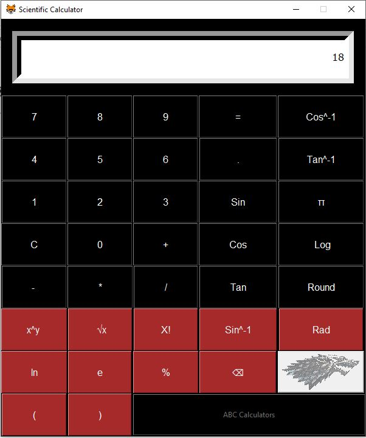

# Python Tkinter project
A simple description of what this project does and who it's for.

## Calculator Design
### Whole Design

### Logo Used

## What is This Projoet For
This Project is somewhat close to a scientific calculator and performs some of its operations.

## Libraries Used in this Project
* math
* tkinter

## Who is it for
* Students who are looking for their semester project and want to create something or already creating this similar project' they can get help from this or even update this.

## <h2 align = "center"> Thank You! </h2> 

